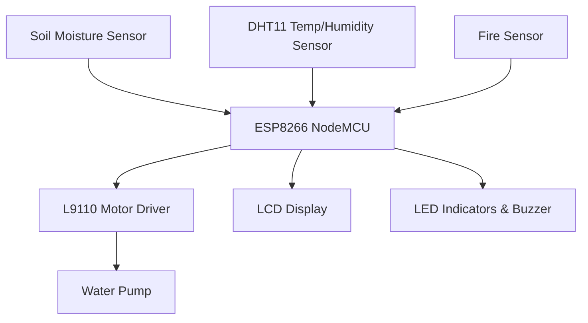

# 🌾 Smart Agricultural Monitoring System

An **IoT-based automation system** designed to optimize irrigation, detect waterlogging, and enhance farm safety in flood-prone regions.  

---

## 📘 Overview

Agriculture in regions like Kerala faces challenges due to unpredictable rainfall, over-irrigation, and flooding.  
This project introduces a **Smart Agricultural Monitoring System** that automates irrigation, detects excess water, and alerts farmers in real time.

The system uses an **ESP8266 microcontroller** integrated with sensors such as soil moisture, temperature, and fire sensors.  
It provides **real-time monitoring**, **automatic pump control**, and **audio-visual alerts** through an LCD, LEDs, and buzzer.

---

## 🚀 Features

- 🌱 **Automatic Irrigation Control** based on soil moisture readings  
- 💧 **Waterlogging Detection** and pump deactivation  
- 🔥 **Fire Detection and Alert System** using temperature monitoring  
- 📟 **Real-Time Display** of temperature, humidity, and soil moisture on LCD  
- 🧠 **Fully Automated Operation** using ESP8266 NodeMCU  
- 🔔 **Visual and Audible Alerts** through LEDs and buzzer  
- ☁️ **IoT-Ready** architecture (future scope for cloud integration and remote monitoring)

---

## 🧩 System Architecture

Below is a simplified architecture diagram showing how sensors, the microcontroller, and actuators interact.

---

## 🧰 Circuit Diagram

The following circuit diagram illustrates the interconnection between the ESP8266 NodeMCU, sensors, motor driver, pump, and alert units.  
The ESP8266 acts as the brain of the system, processing inputs from soil moisture, temperature, and fire sensors, and controlling the pump, LEDs, and buzzer accordingly.

**Key Connections:**
- **A0:** Soil Moisture Sensor  
- **D6:** DHT11 Temperature & Humidity Sensor  
- **D5, D7:** L9110 Motor Driver (Pump Control)  
- **D8:** Buzzer  
- **D0:** Fire LED  
- **D4:** Water Level LED  
- **LCD:** Connected via I2C interface (SDA, SCL)

---

## 🧠 Working Principle

- When the **soil becomes dry**, the ESP8266 **activates the pump** through the L9110 driver.  
- When the soil is **sufficiently moist**, the pump turns **off**.  
- If the soil becomes **too wet**, a **green LED** and buzzer are triggered.  
- If **temperature exceeds a safe threshold**, a **red LED** and buzzer indicate a possible fire.  
- LCD displays messages such as:  
  - “Water In” – irrigation active  
  - “Fine” – optimal condition  
  - “Water Out” – excess moisture detected  

---

## 💻 Software Details

- **Programming Language:** Embedded C/C++  
- **Platform:** Arduino IDE  
- **Simulation Tools:** Tinkercad, Cirkit Designer  
- **Libraries Used:**
  - `Wire.h`
  - `LiquidCrystal_I2C.h`
  - `DHT.h`

### 🔄 Core Functions

1. Initialize sensors, LEDs, buzzer, LCD, and pump.  
2. Continuously read temperature, humidity, and soil moisture.  
3. Convert analog soil-moisture data to percentage.  
4. Control pump automatically based on soil dryness or excess moisture.  
5. Trigger buzzer/LEDs for fire or high-moisture alerts.  
6. Display readings and system status on LCD and Serial Monitor.

---

## ⚙️ Hardware Components

| Component | Description |
|------------|-------------|
| **ESP8266 NodeMCU** | Central microcontroller with Wi-Fi capability |
| **Soil Moisture Sensor** | Measures water content in soil |
| **DHT11 Sensor** | Detects ambient temperature and humidity |
| **L9110 Motor Driver** | Controls the DC water pump |
| **DC Water Pump** | Pumps water into the soil |
| **Buzzer** | Audio alert for fire/excess water |
| **LEDs (Red & Green)** | Visual indicators for alerts |
| **16×2 I2C LCD** | Displays live readings and system status |

---

## 📸 Prototype Images

The final prototype integrates all hardware components, including the ESP8266 microcontroller, DHT11 sensor, soil-moisture sensor, motor driver, LEDs, buzzer, and LCD.  
Below are different views of the working prototype:

### 🔹 Near View

### 🔹 Front View

### 🔹 Top View

---

## 📊 Results

- ✅ Automatic irrigation control based on soil dryness  
- ✅ Real-time fire and flood detection with alerts  
- ✅ Reliable LCD-based monitoring  
- ✅ Efficient power and water utilization  

---

## 📜 License

This project is released under the **MIT License**.  
You are free to use, modify, and distribute it with proper attribution.

---

> *"Empowering sustainable agriculture through intelligent automation."*
