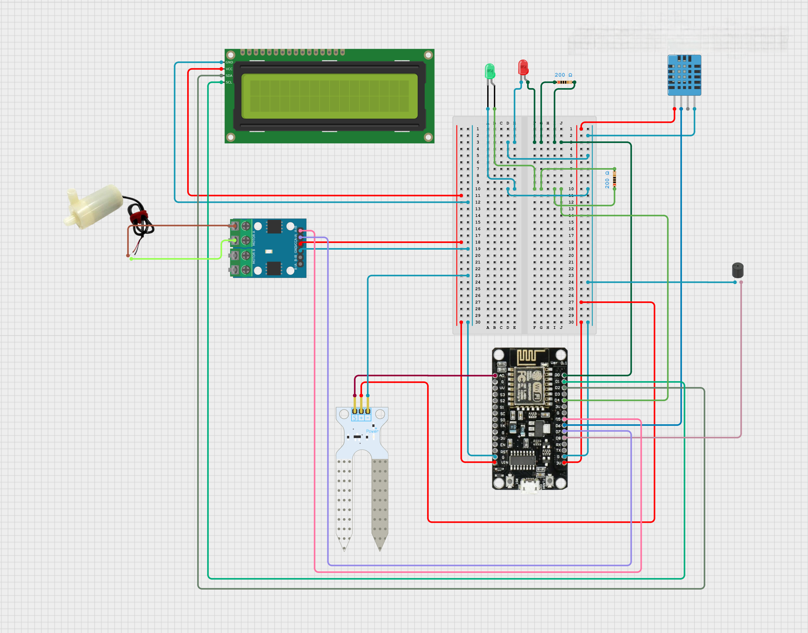
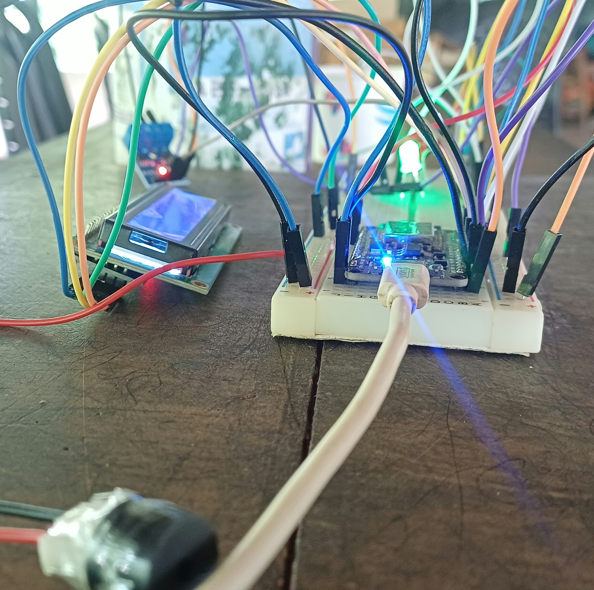
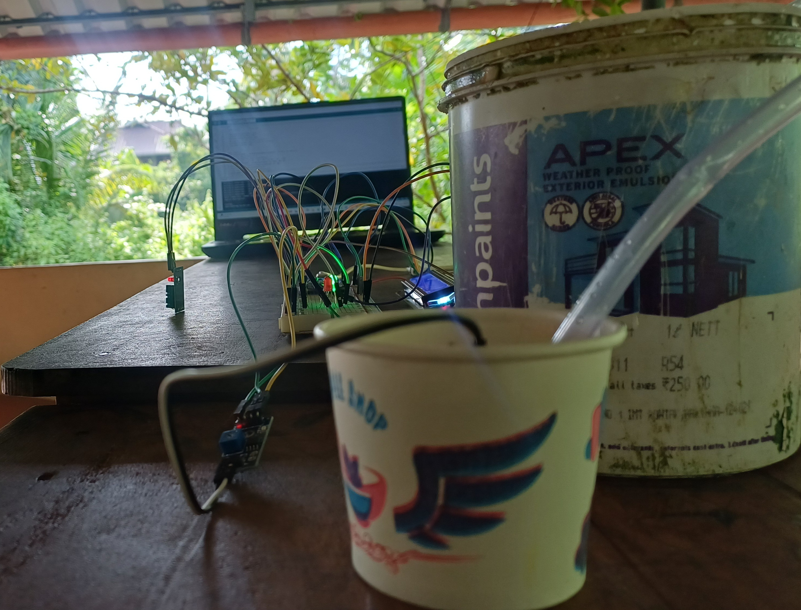

# 🌾 Smart Agricultural Monitoring System

An **IoT-based automation system** designed to optimize irrigation, detect waterlogging, and enhance farm safety in flood-prone regions.  

---

## 📘 Overview

Agriculture in regions like Kerala faces challenges due to unpredictable rainfall, over-irrigation, and flooding.  
This project introduces a **Smart Agricultural Monitoring System** that automates irrigation, detects excess water, and alerts farmers in real time.

The system uses an **ESP8266 microcontroller** integrated with sensors such as soil moisture, temperature, and fire sensors.  
It provides **real-time monitoring**, **automatic pump control**, and **audio-visual alerts** through an LCD, LEDs, and buzzer.

---

## 🚀 Features

- 🌱 **Automatic Irrigation Control** based on soil moisture readings  
- 💧 **Waterlogging Detection** and pump deactivation  
- 🔥 **Fire Detection and Alert System** using temperature monitoring  
- 📟 **Real-Time Display** of temperature, humidity, and soil moisture on LCD  
- 🧠 **Fully Automated Operation** using ESP8266 NodeMCU  
- 🔔 **Visual and Audible Alerts** through LEDs and buzzer  
- ☁️ **IoT-Ready** architecture (future scope for cloud integration and remote monitoring)

---

## 🧩 System Architecture

```mermaid
graph TD
A[Soil Moisture Sensor] --> B[ESP8266 NodeMCU]
C[DHT11 Temp/Humidity Sensor] --> B
D[Fire Sensor] --> B
B --> E[L9110 Motor Driver]
E --> F[Water Pump]
B --> G[LCD Display]
B --> H[LED Indicators & Buzzer]

## 🧰 Circuit Diagram

The following circuit diagram illustrates the interconnection between the ESP8266 NodeMCU, sensors, motor driver, pump, and alert units.  
The ESP8266 acts as the brain of the system, processing inputs from soil moisture, temperature, and fire sensors, and controlling the pump, LEDs, and buzzer accordingly.



**Key Connections:**
- **A0:** Soil Moisture Sensor  
- **D6:** DHT11 Temperature & Humidity Sensor  
- **D5, D7:** L9110 Motor Driver (Pump Control)  
- **D8:** Buzzer  
- **D0:** Fire LED  
- **D4:** Water Level LED  
- **LCD:** Connected via I2C interface (SDA, SCL)

## 📸 Prototype Images

The final prototype integrates all hardware components, including the ESP8266 microcontroller, DHT11 sensor, soil moisture sensor, motor driver, LEDs, buzzer, and LCD.  
Below are different views of the working prototype:

### 🔹 Near View


### 🔹 Front View


### 🔹 Top View


